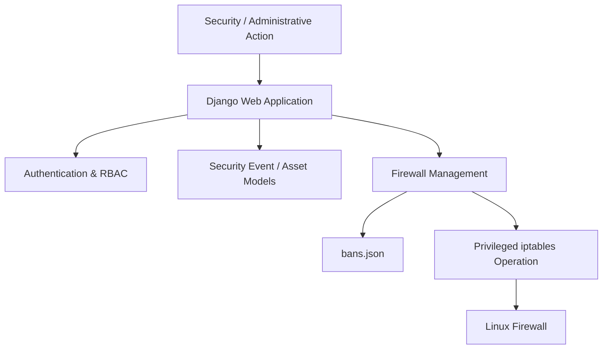

# NetGuard


**NetGuard is a Python/Django-based Linux security monitoring and firewall-management project built in an Ubuntu Server laboratory environment.**

The project was created to explore how a web-based security application can interact with Linux firewall controls while maintaining security-event information, administrative controls, and persistent firewall state.

> **Environment:** Ubuntu Server · VirtualBox · Python 3.12 · Django · Linux `iptables`

---

## Project Focus

**Security Monitoring → Investigation → Containment → Firewall Management**

NetGuard connects application-level administration with Linux firewall enforcement. It is designed as a laboratory project for understanding the security and engineering considerations involved when a web application performs privileged operating-system actions.

---

## What NetGuard Does

### Firewall Management

* Allows authorized administrators to ban and unban IP addresses from the Django interface.
* Updates Linux `iptables` rules based on administrative actions.
* Maintains a local record of banned IP addresses using `bans.json`.

### Security Monitoring

* Models security alerts and assets within the Django application.
* Provides a central interface for reviewing security-related information.
* Supports basic security-monitoring workflows within the laboratory environment.

### Access Control

* Uses Django authentication and role-based access control for administrative functionality.
* Separates application access from privileged firewall operations.

### State Management

NetGuard maintains firewall-related state using both:

* `bans.json` for local ban-state persistence.
* Django models for application-level security information.

This separation was implemented to explore the challenges of maintaining consistent state between a firewall and a web application.

---

## Architecture



### Architectural Responsibilities

| Component     | Responsibility                                      |
| ------------- | --------------------------------------------------- |
| Django        | Web interface, application logic and administration |
| Python        | Application and security-related logic              |
| Django Models | Security alerts, assets and application state       |
| `bans.json`   | Local firewall-ban state                            |
| `iptables`    | Linux firewall enforcement                          |
| Ubuntu Server | Security laboratory environment                     |
| VirtualBox    | Isolated virtualization environment                 |

---

## Security Workflow

The current workflow is designed around controlled firewall administration:

```text
Administrative Request
        │
        ▼
Django Authentication
        │
        ▼
Authorization / RBAC
        │
        ▼
Firewall Management Logic
        │
        ├──────────────► bans.json
        │
        ▼
Privileged iptables Operation
        │
        ▼
Linux Firewall Rule
```

The application therefore demonstrates how a security-focused backend can interact with an operating-system security control while keeping the administrative layer separate from the firewall enforcement layer.

---

## Example Workflow

### Ban an IP Address

1. An authenticated administrator selects an IP address for blocking.
2. NetGuard processes the request through the Django application.
3. The application updates the local ban state.
4. The corresponding `iptables` rule is created.
5. The firewall begins enforcing the block.

### Unban an IP Address

1. An administrator selects a previously banned IP.
2. NetGuard updates the stored ban state.
3. The corresponding firewall rule is removed.
4. The Linux firewall returns to its previous state.

The exact behavior depends on the configured firewall-management logic in the application.

---

## Security Controls

NetGuard was designed to demonstrate several security concepts within a controlled laboratory environment:

| Security Area            | Implementation                         |
| ------------------------ | -------------------------------------- |
| Authentication           | Django authentication                  |
| Authorization            | Role-based access control              |
| Firewall Enforcement     | Linux `iptables`                       |
| Security Information     | Django security-event and asset models |
| State Persistence        | `bans.json` + Django models            |
| Privileged Operations    | Controlled `sudo` access               |
| Administrative Interface | Django backend                         |

---

## Privileged Firewall Operations

NetGuard requires elevated privileges to modify Linux firewall rules.

For laboratory testing, a restricted `sudoers` configuration can be used.

Example:

```text
netguard ALL=(ALL) NOPASSWD: /usr/sbin/iptables
```

### Security Consideration

This configuration is intentionally simplified for the laboratory environment.

Allowing an application account to execute `iptables` without a password can create a significant privilege boundary if the application or account is compromised.

A production implementation should apply stronger least-privilege controls, such as:

* strict argument validation
* dedicated privileged wrapper commands
* a separate privileged service
* stronger administrative authorization
* comprehensive audit logging
* separation between the web application and firewall-control layer

The purpose of this project is to demonstrate the integration and security considerations rather than provide a production-ready firewall-management platform.

---

## Threat Model

The project considers several basic threats associated with application-controlled firewall management.

| Threat                             | Example                                                    | Relevant Control                             |
| ---------------------------------- | ---------------------------------------------------------- | -------------------------------------------- |
| Unauthorized firewall modification | Unauthorized administrator attempts to block/allow an IP   | Authentication and RBAC                      |
| Privilege abuse                    | Compromised application account executes firewall commands | Restricted privileged access                 |
| State inconsistency                | `bans.json` and firewall state become inconsistent         | Centralized management workflow              |
| Malicious state modification       | Unauthorized modification of ban data                      | File permissions and application controls    |
| False or incorrect blocking        | Legitimate IP is blocked                                   | Administrative review and controlled testing |

The threat model is intentionally scoped to the laboratory architecture and does not represent a complete enterprise firewall security model.

---

## Technology Stack

| Technology       | Purpose                            |
| ---------------- | ---------------------------------- |
| Python 3.12      | Application and security logic     |
| Django           | Web application and administration |
| Linux `iptables` | Firewall enforcement               |
| Ubuntu Server    | Security laboratory environment    |
| VirtualBox       | Virtualized test environment       |
| Git              | Version control                    |
| JSON             | Local firewall-state persistence   |

---

## Project Structure

The repository is organized around the Django application, firewall-management functionality and supporting security logic.

```text
netguard/
├── backend/
│   ├── manage.py
│   └── ...
├── ...
├── bans.json
├── requirements.txt
└── README.md
```

> The structure above should be kept synchronized with the actual repository structure as the project evolves.

---

## Installation

### Requirements

* Linux / Ubuntu Server
* Python 3.12
* Django
* `iptables`
* Git
* Python virtual environment

VirtualBox can be used to reproduce the isolated laboratory environment.

### Clone the Repository

```bash
git clone https://github.com/vishchievous01/netguard.git
cd netguard
```

### Create a Virtual Environment

```bash
python3 -m venv venv
source venv/bin/activate
```

### Install Dependencies

```bash
pip install -r requirements.txt
```

### Initialize the Django Application

```bash
cd backend
python manage.py migrate
```

Create an administrative account:

```bash
python manage.py createsuperuser
```

### Start the Development Server

```bash
python manage.py runserver
```

Then access the application at:

```text
http://127.0.0.1:8000/
```

---

## Firewall Configuration

Before using firewall-management features, ensure that the environment is a disposable or isolated laboratory system.

Check the current firewall rules with:

```bash
sudo iptables -L -n -v
```

The application should only be granted the minimum privileges required for the configured firewall-management operations.

---

## Testing

NetGuard was developed and tested in an Ubuntu Server laboratory environment.

Suggested validation workflow:

### Firewall Management

1. Start the Django application.
2. Authenticate through the administrative interface.
3. Add a controlled test IP address.
4. Verify the stored ban state.
5. Verify the corresponding `iptables` rule.
6. Remove the ban.
7. Verify that the firewall state has been restored.

### Example Verification

```bash
sudo iptables -L -n -v
```

The results should correspond with the actions performed through the application.

> Use only controlled test addresses and systems that you own or are explicitly authorized to test.

---

## Screenshots

Screenshots should demonstrate the actual implementation rather than decorative mock-ups.

Recommended screenshots:

### Dashboard

Show the NetGuard administrative/security interface.

```markdown

```

### Firewall Management

Show the ban/unban interface.

```markdown

```

### Security Events

Show the security-event or asset-management interface.

```markdown

```

### Firewall Verification

Show the resulting Linux firewall state.

```markdown

```

Do not include passwords, tokens, private keys, sensitive host information or other confidential data in screenshots.

---

## Design Decisions

### Why Django?

Django provides authentication, authorization, database integration and administrative functionality that make it suitable for building a security-focused backend prototype.

### Why `iptables`?

`iptables` provides direct interaction with Linux packet-filtering controls and makes it possible to demonstrate the connection between application logic and operating-system security enforcement.

### Why `bans.json`?

The local JSON store provides simple persistent state for the laboratory implementation and makes the firewall-management workflow easy to inspect.

A production-oriented implementation would use a more robust state-management mechanism.

---

## Why I Built This

I built NetGuard to understand how a security-focused backend can interact with Linux security controls.

The project gave me practical experience with:

* integrating a web application with operating-system security controls
* handling privileged operations
* implementing authentication and role-based authorization
* maintaining state between an application and a firewall
* modelling security-related information
* designing boundaries between application logic and system-level enforcement
* thinking about least privilege and the risks of application-controlled administrative operations

---

## Limitations

NetGuard is a **laboratory project** and should not be treated as an enterprise firewall-management or SOC platform.

Current limitations include:

* Firewall management is based on Linux `iptables`.
* The project is designed primarily for a single laboratory environment.
* `bans.json` provides simple local state persistence.
* Firewall state and application state can require explicit synchronization.
* The privileged firewall-management model requires additional hardening for production use.
* Detection and security-monitoring capabilities are intentionally limited compared with enterprise SIEM/SOAR platforms.
* The current architecture does not provide distributed state management or high availability.

---

## Future Improvements

Potential improvements include:

* Replace file-based ban persistence with transactional database-backed state.
* Add configurable firewall policies and rule groups.
* Introduce structured security-event schemas.
* Add alert severity and risk classification.
* Implement stronger administrative authorization.
* Create a dedicated privileged service for firewall operations.
* Add comprehensive audit logging for firewall changes.
* Add automated unit and integration tests.
* Add API-based integration with external SIEM platforms.
* Expand security-event detection capabilities.
* Add rule validation before applying firewall changes.
* Add rollback mechanisms for failed firewall operations.

---

## Responsible Use

NetGuard is intended for **educational purposes, security research, and authorized testing in controlled environments**.

Do not use the project to modify, block, monitor or interfere with systems or networks without appropriate authorization.

When testing firewall rules or security-monitoring functionality, use systems and IP addresses that you own or have explicit permission to assess.

---

## Author

**Vishnu P V**

Cybersecurity Professional with a background in software development, security monitoring, Linux and Python.

* GitHub: https://github.com/vishchievous01
* LinkedIn: https://linkedin.com/in/pvvishnu498

---

## License

Add the project's applicable license here.

If this repository is intended for public reuse, consider adding an explicit open-source license such as MIT, Apache-2.0, or another license appropriate for the project.
